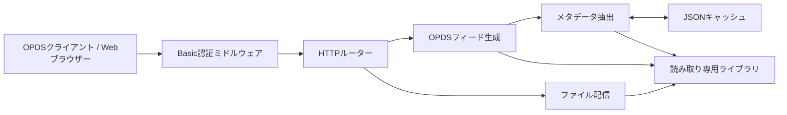

# Armarium 構成仕様書

## 1. 文書の目的

本文書は、Armarium の現行実装に基づくシステム構成、責務、データフロー、設定、セキュリティおよび運用上の制約を定義します。APIとOPDSフィードの詳細は [`opds-api.md`](opds-api.md) を参照してください。

## 2. システム概要

Armarium は、ローカルイントラネットに配置した電子書籍をディレクトリ単位で管理し、OPDS 1.x互換のAtomフィードとHTTPダウンロードとして提供するGo製サーバーです。

- Go 1.26
- Go標準ライブラリのみを使用
- 単一プロセス、単一コンテナ
- ステートレスなHTTP処理と、JSONファイルによるメタデータキャッシュ
- 複数ライブラリ対応
- PDF、EPUB、CBZ、画像ZIP対応

## 3. 論理構成



Docker Composeの既定構成では、ホストの `./books` をコンテナの `/books` へ読み取り専用でマウントし、メタデータキャッシュを名前付きボリューム `armarium-cache` に保存します。

## 4. ソース構成と責務

| パス | 責務 |
|---|---|
| `cmd/armarium/main.go` | 設定ファイルの決定、アプリケーション生成、HTTPサーバー起動 |
| `internal/server/config.go` | JSON設定の読み込み、既定値設定、入力検証 |
| `internal/server/server.go` | 認証、ルーティング、OPDSフィード生成、ファイル配信、パス検証 |
| `internal/server/metadata.go` | 対応形式判定、メタデータ抽出、キャッシュの読み書き |
| `internal/server/server_test.go` | 認証、OPDS、ダウンロード、パス防御、キャッシュの回帰テスト |
| `Dockerfile` | テストと静的バイナリ生成、Distroless実行イメージ作成 |
| `compose.yaml` | ポート、設定、ライブラリ、キャッシュボリュームの定義 |

## 5. 起動シーケンス

1. `ARMARIUM_CONFIG` 環境変数から設定ファイルのパスを取得します。
2. 環境変数が空の場合は、作業ディレクトリの `config.json` を使用します。
3. JSON設定を読み込み、既定値を適用して検証します。
4. `cache_path` に既存のJSONキャッシュがあればメモリへ読み込みます。
5. HTTPルートを登録し、全ルートをBasic認証ミドルウェアでラップします。
6. `listen` で指定したアドレスでHTTPサーバーを開始します。

設定ファイルの読み込みまたは検証に失敗した場合、プロセスはエラーをログへ出力して終了します。

## 6. 設定仕様

設定はJSON形式です。

```json
{
  "listen": ":8080",
  "cache_path": "/data/cache/metadata.json",
  "users": [
    {
      "username": "reader",
      "password_sha256": "e2186dbdb1bb4193608605e84f33208765b5693b55edd4f730a719a100eeea6f"
    }
  ],
  "libraries": [
    {
      "id": "books",
      "name": "書籍",
      "path": "/books/books"
    }
  ]
}
```

### 6.1 トップレベル

| 項目 | 必須 | 既定値 | 説明 |
|---|---:|---|---|
| `listen` | いいえ | `:8080` | HTTPサーバーの待受アドレス |
| `cache_path` | いいえ | `/data/cache/metadata.json` | メタデータキャッシュの保存先 |
| `users` | はい | なし | 1件以上の認証ユーザー |
| `libraries` | はい | なし | 1件以上のライブラリ |

### 6.2 ユーザー

| 項目 | 必須 | 説明 |
|---|---:|---|
| `username` | はい | Basic認証のユーザー名 |
| `password_sha256` | 条件付き | パスワードをSHA-256でハッシュした小文字16進文字列。標準の設定方法 |
| `password` | 条件付き | 平文パスワード。互換性のため使用可能だが非推奨 |

`password_sha256` または `password` の少なくとも一方が必要です。設定ファイルに平文パスワードを残さない `password_sha256` を標準とします。両方を指定した場合は `password_sha256` が優先されます。上記の例はパスワード `change-me` のSHA-256ハッシュであり、運用時は必ず変更する必要があります。

### 6.3 ライブラリ

| 項目 | 必須 | 制約 | 説明 |
|---|---:|---|---|
| `id` | はい | 一意、空文字不可、`/` と `\\` を含まない | URLとURNに使う識別子 |
| `name` | はい | 空文字不可 | OPDSに表示する名称 |
| `path` | はい | 絶対パス | コンテナ内のライブラリルート |

ライブラリのディレクトリ階層を、そのままフォルダまたはシリーズ階層として扱います。専用データベースへの登録処理はありません。

## 7. 認証設計

全エンドポイントにHTTP Basic認証を適用します。受信したパスワードをSHA-256へ変換し、設定値から得たSHA-256値と定数時間比較します。認証に失敗すると `401 Unauthorized` と次のヘッダーを返します。

```http
WWW-Authenticate: Basic realm="armarium", charset="UTF-8"
```

Basic認証は通信内容を暗号化しません。信頼できないネットワークからアクセス可能にする場合は、HTTPSを終端するリバースプロキシを前段に配置する必要があります。

## 8. ライブラリ走査

ArmariumはOPDSリクエストごとに対象ディレクトリを `os.ReadDir` で読み込みます。

- 項目名を小文字化した値で昇順に並べます。
- サブディレクトリはOPDSの `subsection` として出力します。
- 対応拡張子を持つ通常ファイルは取得可能な書籍として出力します。
- 未対応形式はフィードへ出力しません。
- ディレクトリ全体を事前インデックス化するバックグラウンド処理はありません。

## 9. 対応形式とメタデータ

| 拡張子 | MIMEタイプ | タイトル | 著者 | 画像数 | サイズ・更新日時 |
|---|---|---|---|---:|---|
| `.pdf` | `application/pdf` | ファイル名 | 取得しない | 取得しない | 取得する |
| `.epub` | `application/epub+zip` | OPFのtitle、失敗時はファイル名 | OPFのcreator | 取得しない | 取得する |
| `.cbz` | `application/vnd.comicbook+zip` | ファイル名 | 取得しない | 取得する | 取得する |
| `.zip` | `application/zip` | ファイル名 | 取得しない | 取得する | 取得する |

EPUBでは `META-INF/container.xml` から最初のOPFパスを取得し、OPF内の最初にデコードされた `title` と `creator` を使用します。コンテナXMLは最大1 MiB、OPFは最大4 MiBまで読み取ります。

CBZとZIPの画像数には `.jpg`、`.jpeg`、`.png`、`.gif`、`.webp`、`.avif` を数えます。現行のOPDSレスポンスには画像数を出力していませんが、キャッシュ内には保持します。

## 10. キャッシュ設計

キャッシュはプロセス内のマップとJSONファイルで構成されます。キーは電子書籍の絶対パスです。

```json
{
  "/books/books/example.epub": {
    "size": 123456,
    "mod_unix": 1783785600000000000,
    "metadata": {
      "title": "Example",
      "author": "Author",
      "media_type": "application/epub+zip",
      "size": 123456,
      "modified": "2026-07-12T00:00:00Z"
    }
  }
}
```

キャッシュのヒット条件は、ファイルサイズと更新日時のUnixナノ秒値が両方一致することです。不一致または未登録の場合はメタデータを再抽出し、一時ファイルへモード `0600` で書き込んでからリネームします。キャッシュ操作はプロセス内のmutexで直列化します。

キャッシュファイルの読み込み、解析、ディレクトリ作成、書き込みに失敗した場合は処理を継続します。このため、キャッシュは可用性に必須ではありませんが、現行実装ではキャッシュ障害をログへ出力しません。また、削除済みファイルのエントリーを自動消去しません。

## 11. パスとセキュリティ

クエリまたはURLから受け取る相対パスに、次の検査を適用します。

1. URLデコードしてOS固有のパス表現へ変換する
2. `filepath.Clean` で正規化する
3. 絶対パス、`..`、`../` で始まるパスを拒否する
4. ライブラリルートと対象パスのシンボリックリンクを解決する
5. 解決後の対象がライブラリルート自身または配下であることを確認する

これにより、ディレクトリトラバーサルおよびライブラリ外を指すシンボリックリンク経由の取得を拒否します。ライブラリはDocker上でも読み取り専用マウントにすることを前提とします。

## 12. Docker構成

ビルドはマルチステージです。

1. `golang:1.26-alpine` 上で `go test ./...` を実行します。
2. CGOを無効にして静的バイナリを生成します。
3. バイナリのみを `gcr.io/distroless/static-debian12:nonroot` へコピーします。
4. 非rootユーザーで `/armarium` を実行します。

Composeではホストの `8080` をコンテナの `8080` へ公開し、`config.json` と `books` を読み取り専用でマウントします。イメージ名は `ARMARIUM_IMAGE`、タグは `ARMARIUM_TAG` で上書きでき、未指定時は `armarium:latest` です。

### 12.1 Makefileによる操作

| ターゲット | 処理 |
|---|---|
| `make build` | `armarium:latest` をローカルビルド |
| `make up` | Composeでビルドし、バックグラウンド起動 |
| `make start` | `make up` の別名 |
| `make down` | Composeサービスとネットワークを停止・削除 |
| `make tag` | ビルド後にDocker Hub向けタグを付与 |
| `make login` | Docker Hubへ対話的にログイン |
| `make push` | ビルド、タグ付与、Docker Hubへのpush |

ローカルイメージの既定値は `armarium:latest` です。Docker Hubユーザー名に既定値はなく、タグ付与、ログイン、pushの際に `DOCKERHUB_USER` の指定が必須です。`IMAGE_NAME` と `TAG` はMake変数で変更できます。`make push` はDocker Hubリポジトリの作成やログインを自動化しません。

### 12.2 ビルドと起動

ローカルイメージをビルドします。Dockerfileのビルドステージでテストも実行されます。

```sh
make build
```

Composeでビルドし、バックグラウンド起動します。

```sh
make up
```

イメージ名とタグはMake変数で変更できます。

```sh
make build IMAGE_NAME=armarium TAG=v1.0.0
make up IMAGE_NAME=armarium TAG=v1.0.0
```

### 12.3 Docker Hubへの公開

Docker Hubへログインし、公開用タグを付けてpushします。

```sh
make login DOCKERHUB_USER=example
make push DOCKERHUB_USER=example TAG=v1.0.0
```

公開先の完全なイメージ名は、次の形式です。

```text
<DOCKERHUB_USER>/<IMAGE_NAME>:<TAG>
```

`make push` はローカルビルド、公開用タグの付与、`docker push` を順に実行します。Docker Hubのリポジトリは事前に作成してください。

## 13. 障害時の動作

| 状況 | 動作 |
|---|---|
| 設定ファイルがない、またはJSONが不正 | 起動失敗 |
| ユーザーまたはライブラリが0件 | 起動失敗 |
| 認証失敗 | `401 Unauthorized` |
| 不明なライブラリ | `404 Not Found` |
| 不正な相対パス | `400 Bad Request` |
| 対象ディレクトリまたはファイルがない | `404 Not Found` |
| 未対応形式のダウンロード | `400 Bad Request` |
| メタデータ抽出失敗 | ファイル名などの基本情報で配信を継続 |
| キャッシュ読み書き失敗 | インメモリ処理で継続 |

## 14. 現行制約

- OPDS 2.0 JSONではなく、OPDS 1.x互換のAtom XMLを提供します。
- ページング、検索、全文検索、表紙画像、カテゴリ、読書進捗管理はありません。
- PDFの文書プロパティは解析しません。
- EPUBの複数著者や高度な名前空間表現を正規化しません。
- ZIP書庫が画像のみで構成されているかは検証しません。
- キャッシュの世代管理、期限切れ、削除済み項目の掃除はありません。
- HTTPサーバーの読み書きタイムアウトやGraceful Shutdownは設定していません。
- アプリケーション単体ではTLSを終端しません。

## 15. 検証方法

```sh
gofmt -w cmd internal
go test ./...
git diff --check
```

ホストにGoがない場合は、テストを含むDockerビルドを実行します。

```sh
docker compose build
```
